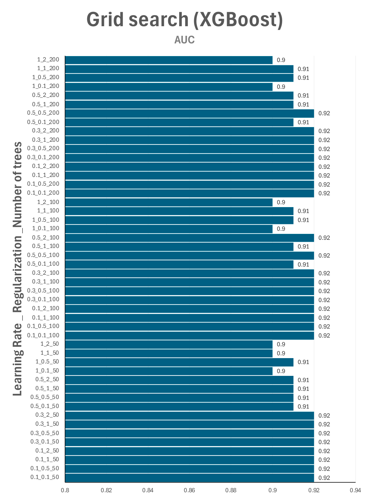

# LBS-AVP

Antiviral peptides prediction.

Dataset obtained in AVPpred: http://crdd.osdd.net/servers/avppred/collection.php?show=dataset

Sequences available at /data/sequences.

Features used in machine learning models are avalable at /data/input

## Feature calculation

Features were obtained using iFeature. 

Features calculated: AAC DPC DDE GAAC GDPC GTPC CTDC CTDT CTDD CTriad KSCTriad

## Supplementary material

**Figure S1.** Hyperparameter grid search for XGBoost. We evaluated the following parameters: number of trees (50, 100, 200), learning rate (0.1, 0.3, 0.5, 1), and regularization (0.1, 0.5, 1, 2). 

